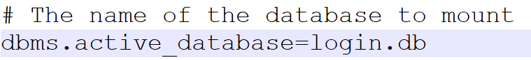
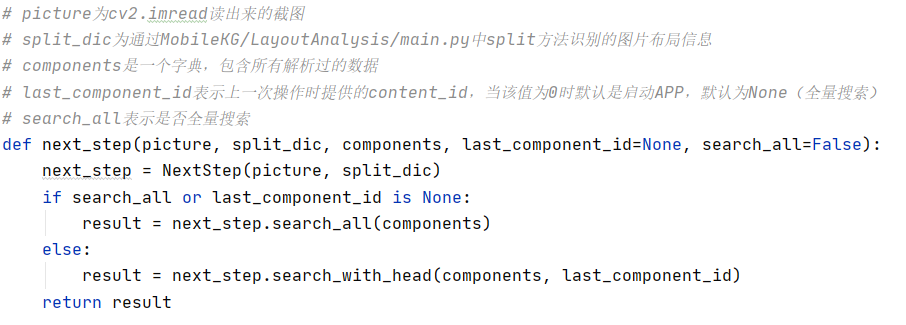
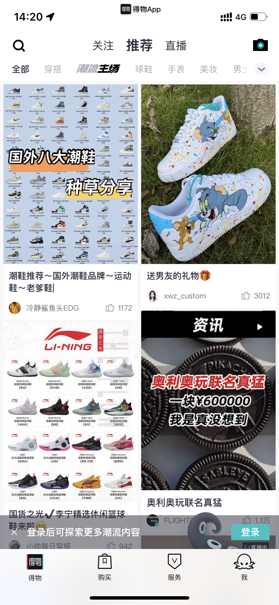

# ScenTest: Scenario-based and GUI-Guided Mobile App Testing via Knowledge Graph
## I Configuration Guide
1. python 3.6 - 3.7
2. See requirements.txt file for other packages. You can run pip install -r requirements.txt in the code environment folder to install the required packages
3. Configure the relevant environment for picture processing according to /PicAnalysis/README.md. This article makes adjustments to the Usage part, see below for details
4. Download and configure neo4j, the version used when building the code is 3.5.5. Versions that support 3.x.x

## II The construction and use of knowledge graph

#### 2.1 configuration database

1. Understand neo4j. It's important to understand that neo4j is a graph database, you can also understand it as a graph corresponding to a database, so for different function points, we should set up different graph databases, for example, we create a graph database named login to Store all the data related to the login function point, and create a graph database named airport to store all the data related to the subscription ticket. Therefore, you need to determine which database needs to be started. This requires you to modify the conf file in the folder of the neo4j database. Only then can the corresponding database be started. The following lists the correspondence between function points and graph database names.<table>
    <table>
    <tr><th>Num.</th><th>Data</th></tr>
    <tr><td>1</td><td>login</td></tr>
    <tr><td>2</td><td>airport</td></tr>
    <tr><td>3</td><td>register</td></tr>
    <tr><td>4</td><td>shopping</td></tr>
    <tr><td>5</td><td>email</td></tr>
    </table>

    If we need to test the login function point, open the conf file in the neo4j folder and edit the following content (graph.db by default)
    

2. Start neo4j. You need to open the command line as an administrator, and enter neo4j.bat console (this is the Windows startup method, mac is similar, please check by yourself). Open http://localhost:7474/ with a browser to see the interactive interface of the knowledge graph. Input match (a) return a is equivalent to MySQL's select *, which can be used to check by itself.

#### 2.2 The logic of knowledge graph generation

1. Run MobileKG/GenerateKG/main.py to start the code to generate the map. The functions in the code are as follows: 

    <table>
    <tr><th>Method/Parameter</th><th>Explanation</th></tr>
    <tr><td>analyze()</td><td>Feature extraction from the original test report</td></tr>
    <tr><td>connect()</td><td>Analyze the content of the test report extracted by the feature, and extract the relationship of the relevant content</td></tr>
    <tr><td>generate()</td><td>Perform coreference resolution on the data extracted from the relationship and add it to the knowledge graph</td></tr>
    <tr><td>Import RunConfig File</td><td>Configuration required at runtime, please refer to this file for specific parameter content</td></tr>
    </table>

2. General Operation Steps:
   * Modify the graph_type in `MobileKG/Config/RunConfig.py` to the specified function point, such as `login` or `airport`
   * Put the original test report into the `MobileKG/Data/Original` folder (or into another folder and modify the `original_data_path` in `MobileKG/Config/RunConfig.py`)
   * The data of the default disassembly report is stored in the `MobileKG/Data/Analyze` folder (or put it in another folder and modify the `analyze_data_path` in `MobileKG/Config/RunConfig.py`)
   * Run `analyze()` method in `MobileKG/GenerateKG/main.py`, the system will automatically disassemble the picture and text information of the test report and save it to the folder pointed to by `analyze_data_path`
   * The disassembled scattered pictures and text information need to be combined below. The default combined intermediate data is stored in the `MobileKG/Data/Result` folder (or put in other folders and modify the `connect_data_path` in `MobileKG/Config/RunConfig.py` )
   * Run `connect()` method in `MobileKG/GenerateKG/main.py`, the system will automatically contact the data disassembled in the previous step, create a new folder with the current time as the file name, and the intermediate data will also be saved in the current time in the folder with the filename. This folder will be saved to the folder pointed to by `connect_data_path`.
   * Run neo4j from the command line. That is, first configure the database of the specified function point according to 2.1, then open the command line as an administrator, and enter `neo4j.bat console`.
   * Modify `generate_data_path` in `MobileKG/Config/RunConfig.py` and set the value to the path of the folder created with the current time as the file name mentioned in the previous step
   * Run `generate()` method in `MobileKG/GenerateKG/main.py`
   * After the operation is over, open the URL `http://localhost:7474/`, enter `match (a) return a` in the input box to see if there is a knowledge graph generated, if it is generated, it means the generation is successful

3. Directly Load Steps:
   
    For example, to load the knowledge graph of the login function point generated in advance
   * Set `generate_data_path` in `MobileKG/Config/RunConfig.py` to `../Data/Result/login/`
   * Run the `generate()` method in `MobileKG/GenerateKG/main.py`
   * After the operation is over, open the URL `http://localhost:7474/`, enter `match (a) return a` in the input box to see if there is a knowledge graph generated, if it is generated, it means the generation is successful

4. Some Solutions of Error
   * If the `synonyms` package cannot be used normally during the running process, it prompts that you need to download `words.vector.gz` when you use it for the first time, and the download speed may be very slow. There are two solutions.
     * Solution 1: Set the `proxy`, please refer to the welcome part of the readme of `https://github.com/chatopera/Synonyms`
     * Solution 2: Manually download the compressed package `https://github.com/chatopera/Synonyms/releases/download/3.15.0/words.vector.gz` or use the compressed package we downloaded in advance (link: `https:// pan.baidu.com/s/1PpHrOYEbW8xQ_25EgP2JQg extraction code: 37j4`), put him in the folder of the error message prompt
   * If the `py2neo` package cannot connect to the neo4j database normally during the running process, try to use the following connection method to solve `https://blog.csdn.net/sinat_33846443/article/details/109023259`

#### 2.3 Graph Query Steps

* When running the logic of querying the graph, you only need to call the `next_step` method in `MobileKG/SearchKG/main.py`. This method requires three parameters, and the meaning of the parameters is shown in the figure.

    

* Here is an example:

  * If what needs to be analyzed now is the start page of the login function point of the "Dewu" APP, the page is as shown below

  

  * The path of this image is `../Test/pictures/dewu-01.png`, then the format of picture and `split_dic` are:

  ```python
  import cv2
  from MobileKG.LayoutAnalysis.LayoutMain import split
  picture = cv2.imread('../Test/pictures/dewu-01.png', 0)
  split_dic = split('../Test/pictures/dewu-01.png')
  ```

  * then the data format of the `components` is something like:

  ```python
  page1_components = {
      "components": [
          {"category": "Button", "x1": 262, "y1": 1761, "x2": 566, "y2": 1781, "ocr": '得物'},
          {"category": "Button", "x1": 262, "y1": 1761, "x2": 566, "y2": 1781, "ocr": '购买'},
          {"category": "Button", "x1": 262, "y1": 1761, "x2": 566, "y2": 1781, "ocr": '服务'},
          {"category": "Button", "x1": 262, "y1": 1761, "x2": 566, "y2": 1781, "ocr": '我'},
      ]
  }
  ```

  * `last_component_id` is 0, because this is the first screenshot of the login function point of "Dewu" APP, that is, the first step, he has no predecessor node
  * `search_all` is recommended to use the default value, which can speed up the search
  * The return value of the search is as follows, an array is returned, the array contains all the components that need to be operated on the page, the following example shows that only one component needs to be operated on the page

  ```python
  components = {
      'status': 'success', 
      'data': [
          {
              'category': 'Button', 
              'ocr': '我', 
              'operation': 'click', 
              'cnt': '我', 
              'cnt_id': 12, 
              'x1': 262, 
              'y1': 1761, 
              'x2': 566, 
              'y2': 1781
          }
      ]
  }
  ```

  * The overall operation code is as follows:

  ```python
  import cv2
  from MobileKG.LayoutAnalysis.LayoutMain import split
  picture = cv2.imread('../Test/pictures/dewu-01.png', 0)
  split_dic = split('../Test/pictures/dewu-01.png')
  page1_components = {
      "components": [
          {"category": "Button", "x1": 262, "y1": 1761, "x2": 566, "y2": 1781, "ocr": '得物'},
          {"category": "Button", "x1": 262, "y1": 1761, "x2": 566, "y2": 1781, "ocr": '购买'},
          {"category": "Button", "x1": 262, "y1": 1761, "x2": 566, "y2": 1781, "ocr": '服务'},
          {"category": "Button", "x1": 262, "y1": 1761, "x2": 566, "y2": 1781, "ocr": '我'},
      ]
  }
  print(next_step(picture, split_dic, page1_components, 0))
  ```

### III Code Structure Guidelines

#### 3.1 Overview

* `MobileKG` is the `Django` backend and `kgfront` is the `Vue` frontend. However, due to time constraints, we did not connect the front and back ends. The temporary front-end display strategy is generated by generating fake json data from the `MobileKG/Test/FormFrontEnd` file in the back-end.


#### 3.2 Config Folder

* This folder mainly stores some special configuration information for the knowledge graph
* The `RunConfig.py` file configures some parameter information at runtime, such as where the intermediate results are saved, the threshold for similarity analysis, etc.
* `OperationConfig.csv` and `Widgetconfig.csv` are used to save operations and controls, that is, before creating a knowledge graph from scratch, the knowledge graph must store the type of operation (such as click, input, etc.) and the type of control (such as button, text, etc.) box, etc.), these information are constant, so these graph entities can be found without analysis, so configure the entities into a file, directly read the file and upload these entities before generating the knowledge graph, no need to analyze and then upload.
* The `SimilarTXTConfig.json` file configures which texts the knowledge graph considers to be similar during runtime. Similar to building a thesaurus based on the field of mobile application function point testing, the specific configuration method can refer to IV configuration file details
* The `TypicalLayoutConfig.json` file configures which similar layouts the knowledge graph can use to find the controls that should be operated during the query process. For the specific configuration method and configuration meaning, please refer to the IV configuration file for details.
* The `SearchPolicy.json` file configures two query modes that users can choose during the process of querying the knowledge graph. Please refer to IV Profile Details for details.

#### 3.3 Data Folder

* The `Original` folder stores the original data for building the knowledge graph. Note that the stored data should be at the application level, not the function point level.
* The `Analyze` folder stores the intermediate data results after extracting the original data features in the `Original` folder.
* The `Result` folder stores the data that has completed feature extraction and relation extraction. This means that these are the data that can directly call the `generate()` method to generate the map.

#### 3.4 FuncTest Folder

* The `test.py` in this folder can realize the whole process of querying the map through a screenshot
* The `screenshot` folder is used to store the results of the query
* Add the path to be queried to the parameters of the `searchKG()` method of `FuncTest/test.py`
* In the code, `FuncTest/screenshot/origin` stores the original image that needs to be queried, `FuncTest/screenshot/widget_res` stores the result after control extraction, and `FuncTest/screenshot/KG_res` draws the result control of the knowledge graph query

#### 3.5 GenerateKG Folder

* This is a folder for knowledge graph generating
* `GenerateMain.py` is the startup entry file for building knowledge graphs
* `Operation` folder includes all operations involved in the process of generating knowledge graph, including feature extraction, relationship extraction, co-reference resolution, etc.
* `PO` folder stores the data classes needed to generate the knowledge graph

#### 3.6 LayoutAnalysis Folder

* This folder is used to perform layout analysis operations on pictures
* It is not used during the construction process, but during the query process
* The query process will first divide the input screenshots into regions according to the horizontal dimension through LayoutMain, and then perform Sift similarity matching between each divided region and the layout picture in Config. If the threshold is exceeded, the matching is considered successful, and the control is locked.

#### 3.7 Neo4j Folder

* This folder is used to operate the `Neo4j` graph database
* `GraphAdd.py` is used to create a new database in `Neo4j` database
* `GraphSearch.py` is used to search what you want in `Neo4j` database

#### 3.8 PicAnalysis Folder

* This folder is mainly responsible for the recognition and extraction of text and controls on the picture

#### 3.9 PICS Folder

* Some pictures needed in the `readme.md` are stored

#### 3.10 SearchKG Folder

* The general entry for querying the knowledge graph is stored in this folder
* Just call the `next_step` method in `SearchMain.py`
* For specific usage and precautions, please refer to the notes in the document

#### 3.11 Test Folder

* This folder is used to store some intermediate results when repairing the map, and provides some interfaces to help you quickly debug
* `DrawLine.py` can help you quickly draw control recognition results, layout analysis results and map query results
* `FormFrontEnd.py` can help you quickly generate the `json` file that the front-end demo needs to use (provided that the data has been generated and stored in the Data folder)

#### 3.12 TextAnalysis Folder

* This folder contains tools for text analysis, that is, the interface of `jieba` word segmentation
* You can use the method here to segment the recurrence step and analyze the part of speech to identify the gerund, etc.
* `LanguageChange.py` has not been implemented subsequently. Currently only supports Chinese.

#### 3.13 WidAnalysis Folder

* Store a pre-trained CNN model. The model can identify whether the widget in the picture is a button or a text box.

## IV Configure File Details

#### 4.1 SimilarTXTConfig.json

This file is used to specify synonyms under a knowledge area.

#### 4.2 TypicalLayoutConfig.json

For those pictures where the text in the picture is not enough to help positioning, we provide a layout configuration method to locate the specified control through the layout

#### 4.3 SearchPolicy.json

This file is used to define query strategies. Our build system provides two ways to query based on textual similarity and to identify queries based on layout. Both query methods are guaranteed to execute, and layout queries precede text queries. However, sometimes we want the layout query to find the control and not to use the text query to find it again, so we added the `type` attribute to the file. If it is the same as it is, select `both`, and if the layout is found, it will not be searched by text, then select `layout`.

 
